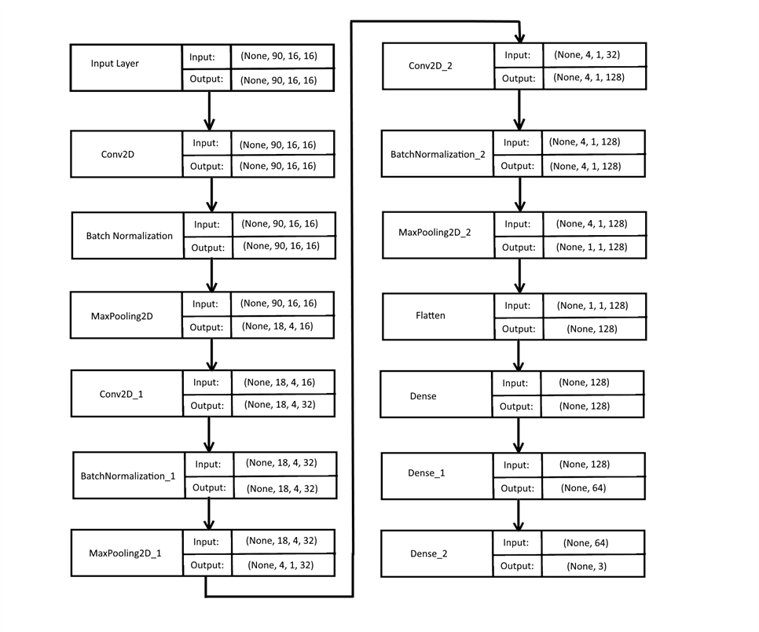

# Klasifikacija geometrijskih likova koristeći EEG podatke

Ovaj projekt istražuje ideju o klasifikaciji geometrijskih tijela pomoću EEG podataka pri čemu se klasificiraju krug, trokut i kvadrat.
EEG podaci prikazani su u protoku voltaže. Snimanje EEG podataka napravljeno je putem uređaja OpenBCI Cyton + Daisy pri čemu su podaci snimani sa jednim ispitanikom. Postavljeno je dodatno pitanje, pitanje relevantnosti EEG podataka kroz vrijeme pri čemu se snimanje podataka sastoji od 6 sesija. Prve tri sesije snimljene su 3.4.2022. i 10.5.2022., a ostale su snimljene 9.9.2022.

## Model

Korišten je CNN model zbog svoje uspješnosti pri treniranju slika, te je zbog toga također trebalo prilagoditi podatke kako bi bili kompatibilni sa ulazom u model

Prikaz arhitekture CNN modela

## Podaci

- Skup podataka(dataset) korišten u projektu nalazi se u [alldata/](alldata/) direktoriju.

## Organizacija
Sveučilište Jurja Dobrile u Puli  
Fakultet informatike u Puli  
Završni rad, ak.god. 2021./2022.     
Mentor: doc. dr. sc. Nikola Tanković (https://fipu.unipu.hr/fipu/nikola.tankovic, nikola.tankovic@unipu.hr)
